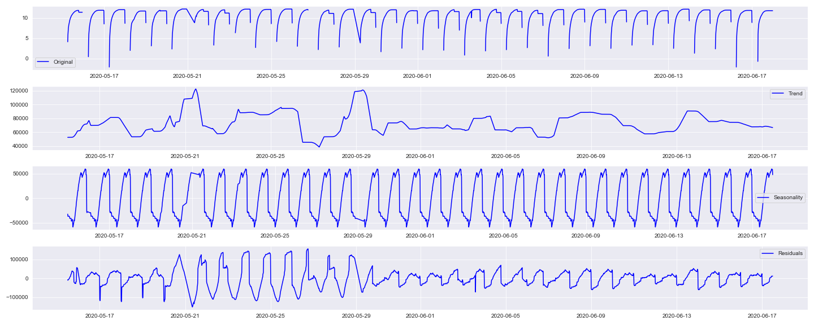
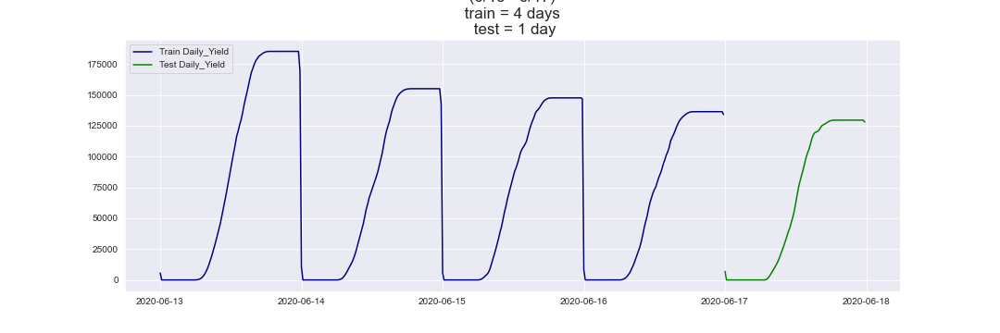
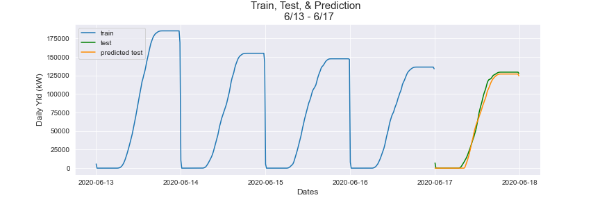
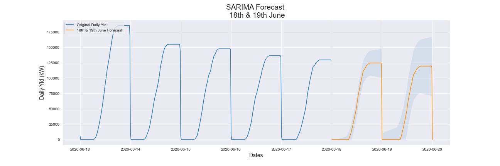
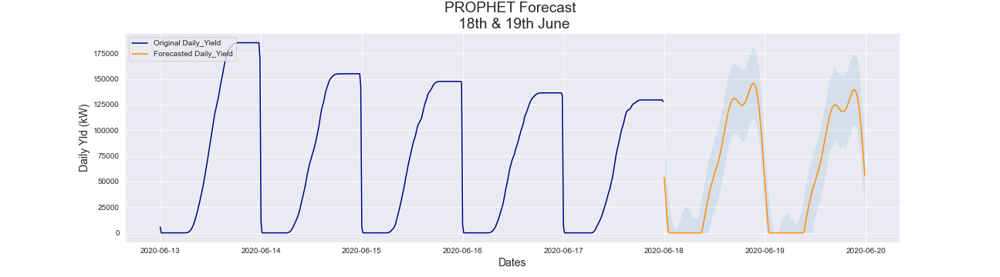

# SOLAR POWER FORECASTING
By Ozair Ahmed

## INTRODUCTION
Traditional power plants can control how much power they produce which allows for power grid operators to easily manage supply and demand. However, most of these traditioanl power plants are coal powered, which are a massive source of air pollution. Integrating renewable energy power plants into the grid would greatly help reduce pollution, however renewable energy sources like solar and wind have variable output since they depend on other factors, primarily the weather. For example, a solar farm will produce more electricity on sunny days than on cloudy days, and this makes it difficult for grid operators to manage supply and demand. Forecasting power output for variable renewable energy sources can help here in that the operators can then know how much power to expect in the future, and if it isn't enough to meet the demand, they can have a traditional power plant on standby, and power it up when the the supply dips below what is needed. The idea here is that by forecasting power output of a solar plant, we can balance it with other sources of power generation. 

## PROJECT OVERVIEW
My goal is to use machine learning algorithms for time series forecasting to forecast power output from a solar plant, and see which model performs the best. I'm going to start off with univariate time series forecasting, where I only use previously recorded output data to forecast future output, and then add ambient temperature as an exogenous variable to see if, and how much, it improves my forecast.

I'm going to use the data from the last 5 days of my dataset to train & test my models, and then forecast the next 2 days. Anything more than 2 days and the accuracy starts dropping significantly, as will be evident by looking at the confidence intervals in my model plots below. For my final model, where I use ambient temperature as an additional feature, I'm going to get historical weather data that goes beyond the weather data contained within the dataset I acquired, and use it to forecast output.

## DATA UNDERSTANDING & PREPARATION
The data was procured from Kaggle. It consists of power ouput and weather data recorded from two separate power plants in India between May 15th, 2020 and June 17th, 2020; 34 days in total. One plant is located near Nashik, Maharashtra and the other near Gandikota, Andhra Pradesh. I had the following data for each plant:

DATE_TIME: Date and timestamp of datapoint- taken every 15 minute

SOURCE_KEY: Inverter ID (22 inverters in total)

DC_POWER: DC power produced by inverter in that 15 minute interval (in kW)

AC_POWER: AC power produced by inverter in that 15 minute interval (in kW)

DAILY_YIELD: Total power produced till that point in time

TOTAL_YIELD: Total yield for the inverter till that point in time

AMBIENT_TEMPERATURE: Weather temperature

MODULE_TEMPERATURE: Solar panel temperature

IRRADIATION: Amount of irradiation for the 15 minute interval.

For the sake of simplicity, I only used data from the first power plant, the goal being that once I perfected my models, I could deploy them elsewhere. I have talked further about this in the section below regarding my next steps.

#### Stationarity
Looking at the power output data from plant 1, I found that it was not stationary, as can be seen in the plot below- the 3rd plot shows daily seasonality, which makes sense since the power output peaks during the day when the sun is out, and drops during the night. When doing time series modeling, it is important that the data is stationary, in that its statisitcal properties, such as mean, variance, etc, remain constant over time. This is because if the dataset shows particular behavior over time, there is a very high probabilty that it will follow a similar behaviour in the future. I will take care of this within the parameters of each model.

#### Data Preparation
I set the data_time column as the index in each of the two datasets for plant 1(power output & weather sensor), after which I isolated the last 5 days of data from each dataset, and then merged them on the index. I only kept two columns: the daily yield and the ambient temperature, since those were the only two features I'd be using within the scope of this project. I then split this dataframe into a training set, holding the first 80% of the data, and a test holdout set with the remaining 20% of the data, as displayed below:

#### Missing Rows
The power output from above was missing two rows, specifically: 6:15am and 6:30am from June 17th. I added these rows manually with the daily yield of 0, since the daily yield during this time in the one day prior and after was 0

#### Performance Metrics
I used the following metrics to analyse model performance:
- R squared (R2), or coefficient of determination, is a statistical measure of how well the regression line approximates the real values. It goes from 0 to 1, and the higher the value the better the performance
- Mean Absolute Error (MAE) is the average of the absolute error, or positive difference, between the predicted and observed value. Here we want to minimize MAE.
- Residual Mean Squared Error (RMSE) is similar to MAE, but the errors are squared, giving more weight to outliers. And as with MAE, we want to minimize this.

Once I had my dataframe with 5 days of data with the feature columns ready, along with it split into a training and testing set, I was now ready to proceed with time series forecasting.

## FORECASTING SOLAR POWER OUTPUT- OVERVIEW
I used three time series algorithms to forecast power output: SARIMA, Facebook PROPHET, and SARIMAX. I have a brief explanation of each algorithm in their respective sections below. As stated above, I used 5 days of data, 6/13/2020 to 6/17/2020, which I prepared above to train and test the models, and then forecasted 2 days ahead, 6/18 and 6/19. For the first two models, I did univariate time searies forecasting using only the previously recorded power ouput data to forecastf forward; and for the third model, SARIMAX, I introduced ambient temperature as an exogenous variable to help with forecasting.

### SARIMA
SARIMA stands for Seasonal AutoRegressive Integrated Moving Average, and is a very popular time series forecasting model. It is great for univariate time series forecasting, and the seasonal component works with non-stationary data- it takes care of the stationarity within the model.

Since I was only going to use daily yield to make my forecast in this model, I isolated that feature within both my training and test datasets.

I then confirmed non-stationarity of my data by doing the Dicky-Fuller test, which is a statistical test for checking stationarity. The test assumes a null-hypothesis that the time series is not stationary. So if the test statistics is less than the critical value, we then reject that null hypothesis and say that the series is stationary. The test on our data returned a test statistic greater than the critical value at 5%, confirming that our dataset is NOT stationary. 

One of the hyperparameters within SARIMA allows us to address the non-stationarity of our data, the differencing order. To find the optimum hyperparameters, I used AUTO-ARIMA, an algorithm which cycles through various combination of hyperparameters to find the best order for forecasting.

#### SARIMA- Model
Once I found the optimum parameters for my dataset, I instanciated an instance of the model, fitted it to the training data (6/13 to 6/16), predicted daily yield for 6/17, and then compared this against the actual daily yield in my test set for 6/17. Following are the performance metrics for my SARIMA model:

SARIMA train R2 Score: 0.984636

SARIMA test R2 Score: 0.992781

SARIMA train MAE Score: 1271.469147

SARIMA test MAE Score: 3392.311740

SARIMA train RMSE Score: 8481.602910

SARIMA test RMSE Score: 4836.309328

#### SARIMA- Two Day Output Forecast
I used the same parameters above to instanciate another SARIMA model, and fit it to the entire daily yield data from the previous 5 days. And then forecasted daily yield for 6/18 and 6/19. Per my SARIMA forecast: 

18th Jun Forecasted Output per SARIMA:  ~125000 kW

19th Jun Forecasted Output per SARIMA:  ~119000 kW

### Facebook PROPHET
PROPHET is an open source library by Facebook which can be used for time series forecasting. It is more intuitive than SARIMAX, and also faster.

It requires the data that we feed it to have 2 columns: **ds** (with date_time values) & **y** (the time series feature). So I transformed my training and test data to the required format.

#### PROPHET- Model
Once I had my datasets prepped, I instanciated the model, fitted it to the training data, predicted output for 6/17, and compared it to the actualy output in the test dataset. Performance metrics for my PROPHET model:

Prophet Test R2 Score: 0.941193

Prophet Test MAE Score: 7681.413889

Prophet Test RMSE Score: 13927.544700

#### PROPHET- Two Day Output Forecast

Fitting the model to the entire 5 day output data, resulted in the follwoing forecast:

18th Jun Forecasted Output per PROPHET:  146000 kW

19th Jun Forecasted Output per PROPHET:  140000 kW

## FUTURE IMPROVEMENT IDEAS
- LSTM Neural Network
- Download more historical weather data parameters, such as humidity, precipitation, windspeed, and cloudcover, and see correlations between these parameters vs. solar power production vs. irradiation
- Extend my analysis and modeling to wind farms
- Looking at the correlation between weather params, look at locations around the world best for solar and wind farms.
- Package model that it can be deployed.

Notes:
polish over brilliance- clean and concise narrative of what I did.
focus on producing clean work right now
do break down the concepts, employers will appreciate that
