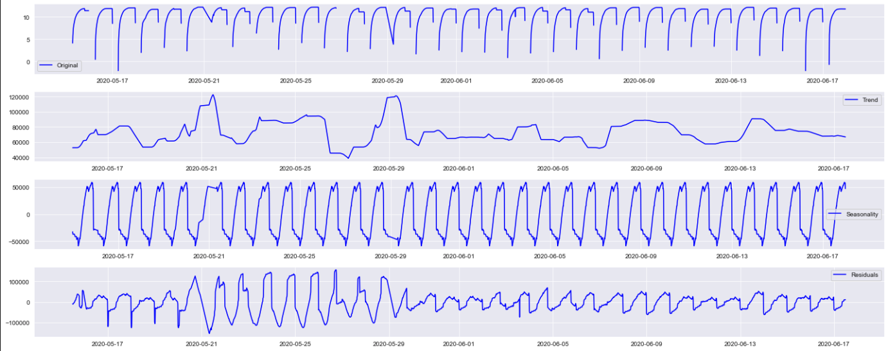

# SOLAR POWER FORECASTING
By Ozair Ahmed

## INTRODUCTION
Traditional power plants can control how much power they produce which allows for power grid operators to easily manage supply and demand. However, most of these traditioanl power plants are coal powered, which are a massive source of air pollution. Integrating renewable energy power plants into the grid would greatly help reduce pollution, however renewable energy sources like solar and wind have variable output since they depend on other factors, primarily the weather. For example, a solar farm will produce more electricity on sunny days than on cloudy days, and this makes it difficult for grid operators to manage supply and demand. Forecasting power output for variable renewable energy sources can help here in that the operators can then know how much power to expect in the future, and if it isn't enough to meet the demand, they can have a traditional power plant on standby, and power it up when the the supply dips below what is needed. The idea here is that by forecasting power output of a solar plant, we can balance it with other sources of power generation. 

## PROJECT OVERVIEW
My goal is to use machine learning algorithms for time series forecasting to forecast power output from a solar plant, and see which model performs the best. I'm going to start off with univariate time series forecasting, where I only use previously recorded output data to forecast future output, and then add ambient temperature as an exogenous variable to see if, and how much, it improves my forecast.

I'm going to use the data from the last 5 days of my dataset to train & test my models, and then forecast the next 2 days. Anything more than 2 days and the accuracy starts dropping significantly, as will be evident by looking at the confidence intervals in my model plots below. For my final model, where I use ambient temperature as an additional feature, I'm going to get historical weather data that goes beyond the weather data contained within the dataset I acquired, and use it to forecast output.

## DATA UNDERSTANDING & PREPARATION
The data was procured from Kaggle. It consists of power ouput and weather data recorded from two separate power plants in India between May 15th, 2020 and June 17th, 2020; 34 days in total. One plant is located near Nashik, Maharashtra and the other near Gandikota, Andhra Pradesh. I had the following data for each plant:

DATE_TIME: Date and timestamp of datapoint- taken every 15 minute

SOURCE_KEY: Inverter ID (22 inverters in total)

DC_POWER: DC power produced by inverter in that 15 minute interval (in kW)

AC_POWER: AC power produced by inverter in that 15 minute interval (in kW)

DAILY_YIELD: Total power produced till that point in time

TOTAL_YIELD: Total yield for the inverter till that point in time

AMBIENT_TEMPERATURE: Weather temperature

MODULE_TEMPERATURE: Solar panel temperature

IRRADIATION: Amount of irradiation for the 15 minute interval.

For the sake of simplicity, I only used data from the first power plant, the goal being that once I perfected my models, I could deploy them elsewhere. I have talked further about this in the section below regarding my next steps.

#### Stationarity
Looking at the power output data from plant 1, I found that it was not stationary, as can be seen in the plot below- the 3rd plot shows daily seasonality, which makes sense since the power output peaks during the day when the sun is out, and drops during the night. When doing time series modeling, it is important that the data is stationary, in that its statisitcal properties, such as mean, variance, etc, remain constant over time. This is because if the dataset shows particular behavior over time, there is a very high probabilty that it will follow a similar behaviour in the future. I will take care of this within the parameters of each model.

#### Missing Rows

## FORECASTING SOLAR POWER OUTPUT- OVERVIEW
I used 3 time series algorithms to forecast power output: SARIMA, Facebook PROPHET, and SARIMAX. I used 5 days of data, 6/13/2020 to 6/17/2020, to train and test the models, and then forecasted 2 days ahead. For the first two models, I only used the power ouput data, and for the third model, SARIMAX, I introduced ambient temperature as an exogenous variable to see if it would help my model forecast better.

### SARIMA
I started by first checking for seasonality by doing the Dicky-Fuller test on my power output dataset. When doing time series analysis, it is important that we don't have seasonality. Here, my p-value was greater than 0.05, meaning it had failed the test, and therefore this dataset had seasonality. I confirmed this by doing a seasonal decomposition, where we can see that there is at least a daily seasonality. 

I then plotted the ACF (Auto Correlation Function) and PACF (Partial Auto Correlation Function) plot to get an idea of what values to use for my AR and MA components.

## METRICS
coefficient of determination, or R squared, is a statistical measure of how well the regression line approximates the real values.

## FUTURE IMPROVEMENT IDEAS
- LSTM Neural Network
- Download more historical weather data parameters, such as humidity, precipitation, windspeed, and cloudcover, and see correlations between these parameters vs. solar power production vs. irradiation
- Extend my analysis and modeling to wind farms
- Looking at the correlation between weather params, look at locations around the world best for solar and wind farms.
- Package model that it can be deployed.

Notes:
polish over brilliance- clean and concise narrative of what I did.
focus on producing clean work right now
do break down the concepts, employers will appreciate that
